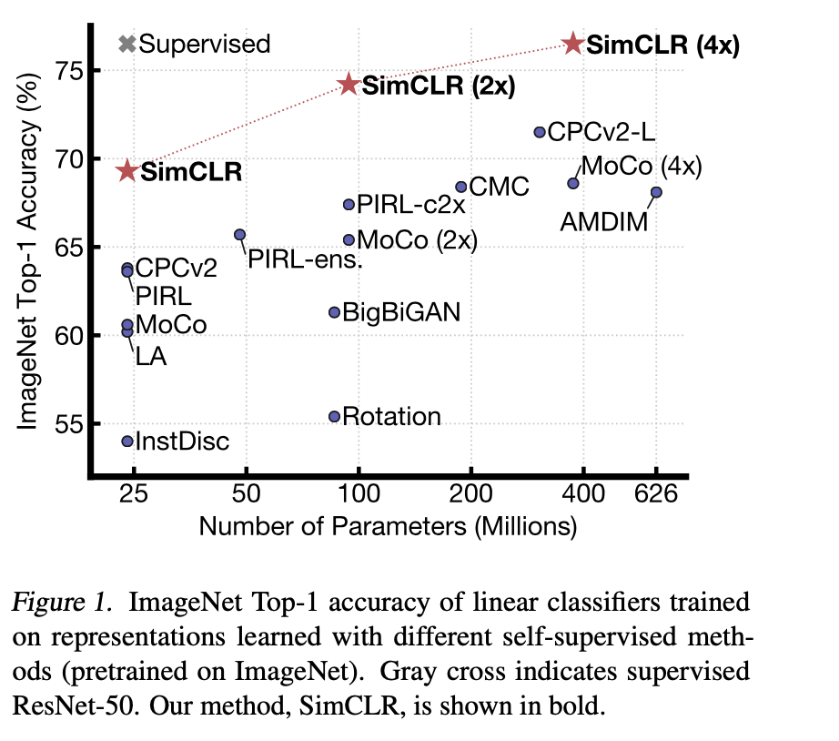
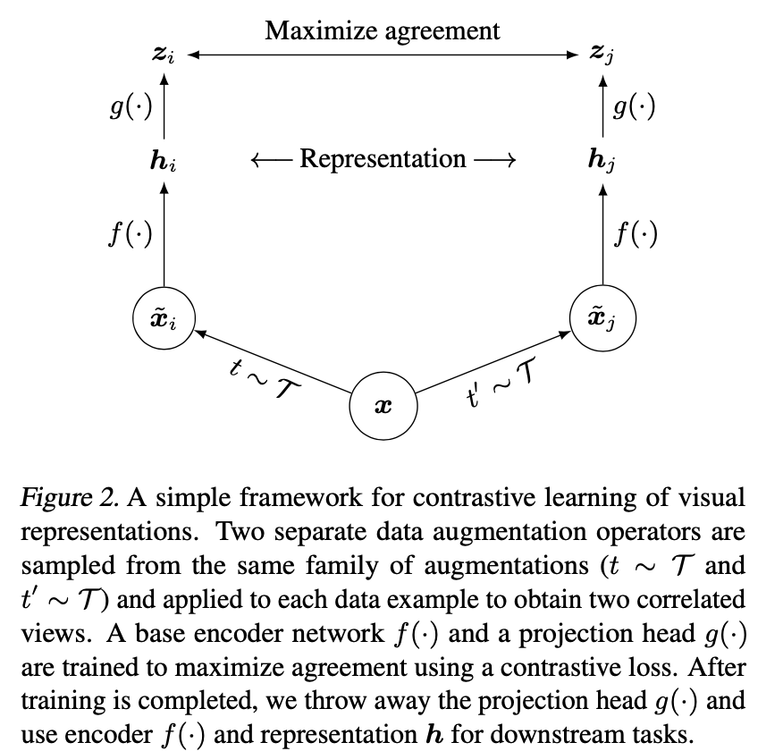
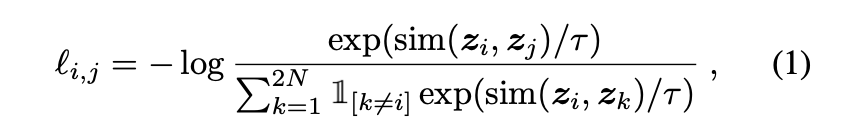
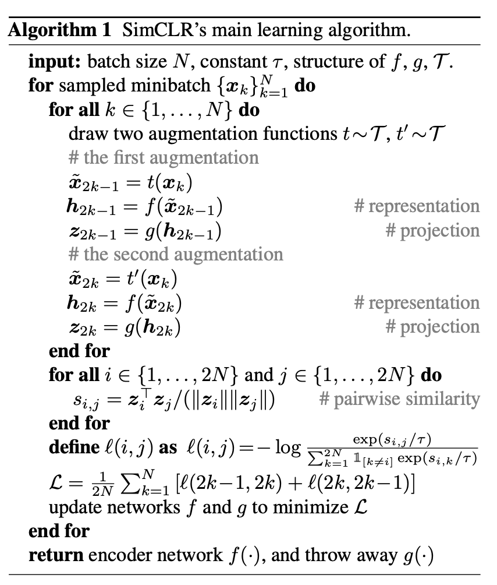
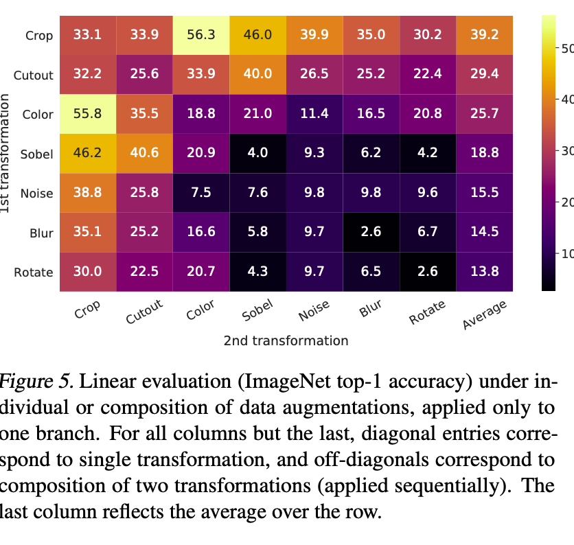
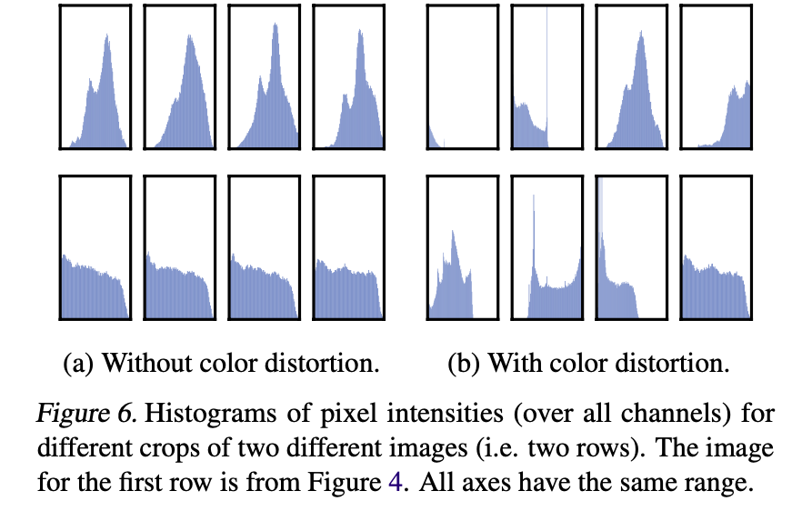

### Simple Framework for Contrastive Learning of Visual Representations

----

* Author: Ting Chen, Simon Kornblith, Mohammad Norouzi, **Geoffrey Hinton**
  * Google Research Brain Team
* ICML 2020

* Overview
  * 최근에 제안한 **contrastive self-supervised learning**을 아키텍처, memory bank? independent하게 간소화한 버전을 제안함
  * contrastive loss가 representation에 왜 도움이 되는지를 광범위한 실험을 통해 입증하고자 했음 (실험 엄청 탄탄함..)
    * **(1) composition of data augmentations**
    * (2) **representation과 contrastive loss 간에 nonlinear transformation**을 학습하는 것
      * 이거 그냥.. contrastive loss 줄때 nonlinear transformation (FC layer w/ ReLU?)로 임베딩한 벡터간의 loss를 줄여주는 것 뿐인데...?? 이걸 contribution으로??
    * (3) **large batch size** 중요

* Introduction

  * representation을 label 없이 학습하는 접근을 많이 하고 있음
  * 특히 discriminative approach에서는 supervised learning과 유사한 objective function을 사용해서 (autoregressive한 loss 혹은 pretext task 등) label이 없지만 데이터 내에서 예측 할만한 레이블을 만들어서 학습하는 방식을 취하고 있음
  * constrastive learning이 새로운 가능성을 보이고 있고, 최근 이를 활용한 방법들이 SOTA 결과를 보이고 있음

  

* Method

  * **2.1 The Contrastive Learning Framework**

* 

  * SimCLR은 동일 데이터에 다른 augmentation을 가한 두 샘플의 similarity를 올라가도록 학습함
    * **Stochastic data augmentation**
      * random cropping, random color distortions, random Gaussian blur
    * A neural network base encoder ... (당연한거 아닌가??...)
    * projection head... (이것도...??..) -> 나중에 ablation study에서 효과가 크다고 나와있음 -> 상세히 분석 필요
    * **Constrastive loss function ** (NT-Xent; normalized temperature-scaled cross entropy loss)
      * 
      * Similarity metric -> cosine similarity (dot product between l2 normalized vectors)

  

  * 마지막에 l(2k-1, 2k) + l(2k,2k-1) => 분자는 같지만, 분모가 다름 어떤 target data를 기준으로 similarity 합을 계산해서 normalize할지

* **Training w/ Large Batch Size**
  * contrastive loss가 정확하게 계산되려면 batch size가 많아야함 (positive pair 대비 negative examples간의 분포 비율을 제대로 계산할 수 있음)
  * Large batchsize를 사용하게되면 많은 task들에서 SOTA optimizer로 사용되는 SGD/Momentum에 stochasticity가 줄어들면서 효과가 줄어드는 이슈가 발생함
  * 제안한 방법에서는 [LARS optimizer](LARS.md)를 사용함

* **Data Augmentation for Contrastive Represenations Learning**

  * **Data augmentation defines predictive tasks**
    * 기존의 많은 연구들은 contrastive prediction task를 아키텍쳐를 바꿔서 적용 (정의)해 왔음
      * Global-to-local view prediction via contraining recepctive field
      * neighboring view prediction 
    * 해당 논문에서는 random cropping을 이용해서 좀 더 간단한 방식의 augmentation을 사용했음
      * Random cropping으로 기존 연구에서 반영하고자 했던 global-to-local view & neighboring view 모두 반영할 수 있음
      * 또 아키텍쳐로 contrastive prediction을 하게되면 self-supervised learning이 architecture에 orthogonal하지 않게되는 이슈가있음
  * **Composition of data augmentation operations is crucial for learning good representations**
    * 개별적인 augmentation과 복합적으로 가하는 augmentation의 효과를 검증하고자 했음
    * 아래 그림을 보면, Crop 다음에 color distortion 혹은 연순의 augmentation compostition과 개별 augmentation (diagonal entries) 대비 성능 차이가 많이 발생하는 것을 알 수 있음
    * 
  * **Contrastive learning needs stronger data augmentation than supervised learning**
    * Visual representation task에서는 color distortion augmentation이 굉장히 중요했음 (ImageNet, CIFAR10)
    * supervised learning에서는 적당한 정도의 color augmentation이 도움이되는 반면에 contrastive loss에서는 좀 더 강하게 줘도 eventually 성능에 도움이 되는 것을 확이함
    * 
    * 

* **Architectures for Encoder and Head**

  * Unsupervised contrastive learning benefits from bigger models
  * A nonlinear projection head improves the representation quality of the layer before it

* **Loss Functions and Batch Size**

  * Normalized cross entropy loss with adjustable temperature works better than alternatives
  * Contrastive learning benefits from larger batch sizes and longer training

* **Comparison with SOTA**

  